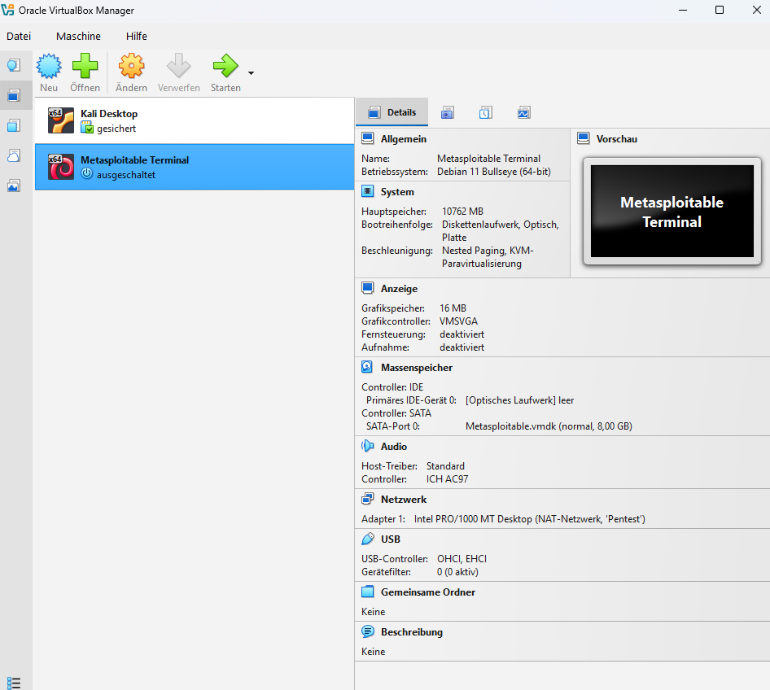
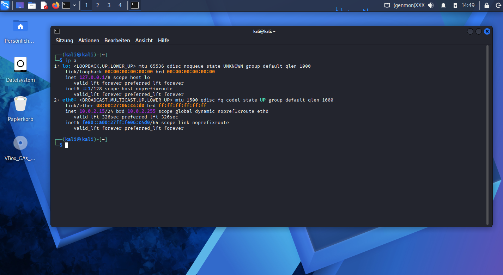
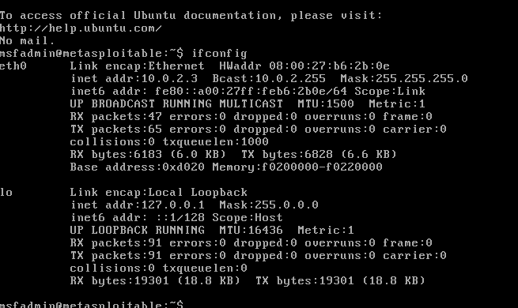
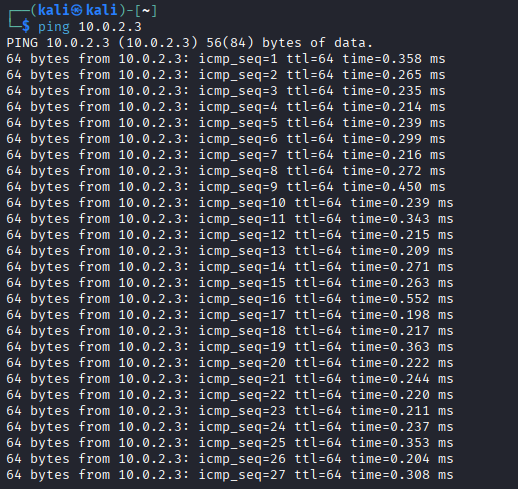
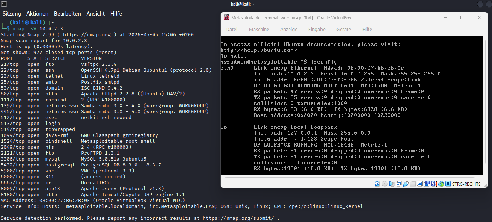

# 🧠 Homelab: Kali Linux & Metasploitable2

## 📌 Überblick

Dieses Projekt dokumentiert den Aufbau eines isolierten Pentest-Homelabs mit VirtualBox.
Ziel ist es, grundlegende Fähigkeiten im Bereich IT-Security und Penetration Testing praktisch zu erlernen und nachvollziehbar zu dokumentieren.

---

## 🎯 Projektziel

* Aufbau einer sicheren Testumgebung
* Durchführung erster Netzwerkscans
* Analyse von offenen Ports und Diensten
* Dokumentation der Ergebnisse für ein GitHub-Portfolio

---

## 🖥️ Umgebung

* Host-System: Windows 11
* Virtualisierung: Oracle VM VirtualBox
* Angreifer-System: Kali Linux
* Zielsystem: Metasploitable 2

---

## 🧱 Architektur

```txt
+----------------------+        +----------------------+
|     Kali Linux       |        |   Metasploitable2    |
|   (Angreifer)        | -----> |     (Zielsystem)     |
|                      |        |                      |
+----------------------+        +----------------------+

        \__________ Host-Only Netzwerk __________/
```

---

## 📂 Projektstruktur

```txt
homelab-kali-metasploitable
│
├── README.md
├── docs
│   ├── projektplan.md
│   ├── setup_kali.md
│   ├── setup_metasploitable.md
│   ├── network.md
│   └── first_scan.md
│
├── scans
│   └── metasploitable_first_scan.txt
│
└── screenshots
```

---

## ⚙️ Setup (Kurzfassung)

### 1. VirtualBox installieren

VirtualBox wird als Virtualisierungssoftware verwendet.

### 2. Kali Linux importieren

* OVA-Datei herunterladen
* In VirtualBox importieren
* Ressourcen anpassen (RAM/CPU)

### 3. Metasploitable2 einrichten

* VM erstellen
* VMDK einbinden
* System starten

### 4. Netzwerk konfigurieren

* Beide VMs im **Host-Only Adapter**
* Kommunikation nur innerhalb des Labs

---

## 🌐 Netzwerk

Beide Systeme befinden sich im gleichen isolierten Netzwerk:

```txt
Kali Linux        → 192.168.56.xxx
Metasploitable2  → 192.168.56.xxx
```

Verbindungstest:

```bash
ping <IP-Adresse>
```

---

## 🔍 Erster Scan

Durchgeführt mit:

```bash
nmap -sV -O <IP-Adresse>
```

### Erklärung:

* `-sV` → Versionserkennung der Dienste
* `-O` → Betriebssystem-Erkennung

---

## 📊 Beispiel-Ergebnisse

Typische offene Ports auf Metasploitable2:

* 21 → FTP
* 22 → SSH
* 23 → Telnet
* 80 → HTTP
* 3306 → MySQL

---

## 📸 Screenshots



Übersicht der VM


Abrufen der Kali IP


Abrufen der Metasploitable IP


Ping Test an Metasploitable


Scan vom Metasploitable System


---

## 🧠 Lessons Learned

* Aufbau eines isolierten Testnetzwerks
* Verständnis von IP-Kommunikation
* Nutzung von Nmap für erste Analysen
* Dokumentation technischer Projekte
* Strukturierung eines GitHub-Repositories

---

## ⚠️ Sicherheitshinweis

Dieses Homelab dient ausschließlich zu Lernzwecken.
Alle Tests werden nur auf eigenen, lokalen Systemen durchgeführt.

---

## 🚀 Nächste Schritte

* Einsatz von Metasploit (`msfconsole`)
* Durchführung erster Exploits
* Erstellung eines vollständigen Pentest-Reports
* Automatisierung von Scans mit Python

---

## 📈 Motivation

Dieses Projekt ist Teil meines Lernprozesses im Bereich IT-Security und Pentesting.
Ziel ist es, praktische Erfahrung aufzubauen und diese nachvollziehbar zu dokumentieren.

---
